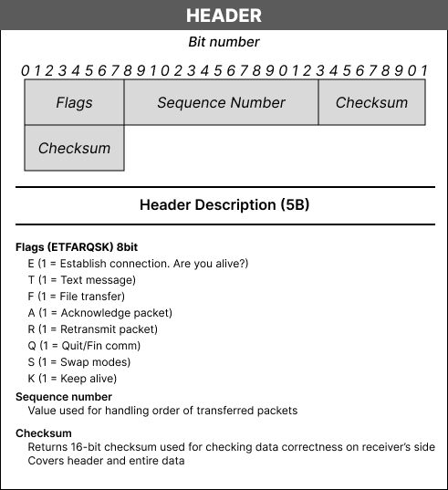

# UDP Receiver Program

## Overview
This program is designed to receive data packets over a UDP connection using custom protocol named UDPKS2. It supports file and message transfers, keeping connections alive, and handling errors and acknowledgments.

## Features
- Receive data packets (files or messages) over UDP.
- Display progress with an optional progress bar.
- Acknowledge received packets and request retransmissions for corrupted ones.
- Handle various control flags for connection management.
- Swap roles between receiver and sender as needed.

## How to Use

1. **Start the Program**:
   Run the program and note the displayed IP address.

2. **Select Mode**:
   - **Receiver**: Specify the listening port. Optionally, configure logging and file storage preferences.
   - **Sender**: Enter the destination IP and port. Choose to send text messages, files (with fragment size and name), or manage communication modes.

3. **Monitoring**:
   - **Receiver**: Monitors incoming data packets, offering logging options and a loading bar display.
   - **Sender**: Provides options for simulating packet errors, displaying progress bars, and logging packet details.
   - **Wireshark**: Check custom [lua script](my_protocol.lua) in repository for better identification of the protocol UDPKS2 in wireshark

4. **Additional Features**:
   - Both modes include advanced features such as mode switching and detailed packet management.

## Protocol Header
The program uses a custom UDP protocol with the following header structure:

## Documentation
For detailed documentation on the program's functions, classes and interface, please refer to the [Documentation](Documentacia_PKS_Z2.pdf).

## Requirements
- Python 3.x
- `tqdm` for progress bar
- `socket` for network communication
- `hashlib` for checksum verification
- `keyboard` for hotkey support
